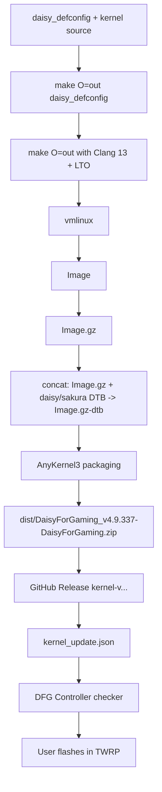
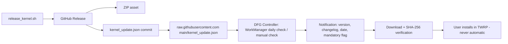

# ARCHITECTURE

How the DaisyForGaming kernel is structured, built, and packaged.

## Overview

DaisyForGaming is a standard Linux **4.9.337** kernel tree (arm64) for the
Qualcomm msm8953 platform (Xiaomi Mi A2 Lite, `daisy`), forked from the
Android 11 base of `Couchpotato-sauce/kernel_xiaomi_sleepy`. The tree follows
the upstream kernel layout: `arch/`, `block/`, `crypto/`, `drivers/`,
`fs/`, `include/`, `init/`, `ipc/`, `kernel/`, `lib/`, `mm/`, `net/`,
`security/`, `sound/`, `tools/`, `scripts/`, `firmware/`, plus the platform's
vendor-integration directories.

## Components

### Source layout (relevant parts)

| Path | Role |
| ---- | ---- |
| `arch/arm64/configs/daisy_defconfig` | The project's kernel configuration (source of truth for features) |
| `arch/arm64/boot/dts/qcom/msm8953-qrd-sku3-daisy.dts` | Device tree source for daisy |
| `arch/arm64/boot/dts/qcom/msm8953-qrd-sku3-sakura.dts` | Device tree source for sakura (same msm8953-qrd-sku3 platform) |
| `block/bfq-iosched.c` (+ merged `bfq-*` objects) | BFQ scheduler, backported and fixed for 4.9.337 |
| `fs/sync.c` | Dynamic fsync toggle (`dyn_fsync`) |
| `kernel/kallsyms.c` | KALLSYMS_HARDENED masking (code present; not enabled in `daisy_defconfig`) |
| `net/ipv4/tcp_bbr.c` | BBR congestion control |
| `drivers/power/supply/qcom/qpnp-smbcharger_d1a.c` | daisy charger driver with `gaming_charge` toggle |
| `pack/ak3/` | AnyKernel3 flashable template (boot-image patcher) |
| `scripts/` | Kernel scripts + project tooling (`build_kernel.sh`, `release_kernel.sh`, `sync_to_github.sh`) |
| `.github/workflows/kernel-build.yml` | CI: build validation on push, release job on `kernel-v*` tags |
| `kernel_update.json` | Update manifest consumed by DFG Controller |
| `DFGController-update-checker/` | App-side kernel update checker module (Kotlin) |

### Configuration

- Default config: `daisy_defconfig` (committed).
- Build-time config: `make O=out daisy_defconfig` produces `out/.config`.
- Notable settings: `CONFIG_LOCALVERSION="-DaisyForGaming"`,
  `CONFIG_HZ=300`, `CONFIG_NR_CPUS=8`, `CONFIG_LTO_CLANG=y`,
  `CONFIG_TCP_CONG_BBR=y`, `CONFIG_DEFAULT_TCP_CONG="cubic"`,
  `CONFIG_IOSCHED_BFQ=y`, `CONFIG_DEFAULT_BFQ=y`,
  `CONFIG_CPU_FREQ_GOV_INTERACTIVE=y`, `CONFIG_ZRAM=y`.

### Toolchain

- Compiler: **Proton Clang 13** (`/opt/toolchains/proton-clang-13`) — `clang-13`
  with LLVM `ld.lld`, `llvm-ar`, etc. and bundled aarch64 binutils.
- Cross prefixes: `CROSS_COMPILE=aarch64-linux-gnu-` and
  `CROSS_COMPILE_ARM32=arm-linux-gnueabi-` (for 32-bit compat code).
- Build style: out-of-tree (`O=out`), parallel `make -j$(nproc)`, host tools
  (kconfig etc.) built with the *system* compiler — the toolchain must stay
  **last** in `PATH` so host binaries link with system `ld` (see
  `docs/TROUBLESHOOTING.md`).

## Boot flow and image generation

1. The build produces `out/arch/arm64/boot/Image.gz-dtb` — a single file
   containing the compressed kernel plus the appended device tree blob(s).
2. The build log shows both `msm8953-qrd-sku3-daisy.dtb` and
   `msm8953-qrd-sku3-sakura.dtb` being compiled and appended, then the whole
   thing is gzip-compressed into `Image.gz-dtb` (about 12.5 MB).
3. `scripts/release_kernel.sh` copies `Image.gz-dtb` into `pack/ak3/`
   (AnyKernel3) and zips the directory into `dist/DaisyForGaming_v<version>.zip`.

## Packaging (AnyKernel3)

`pack/ak3/` is the AnyKernel3 template (by osm0sis, MIT license) configured
for daisy:

- `do.devicecheck=1`, `device.name1=daisy`, `device.name2=Mi_A2_Lite` —
  installation aborts on any other device.
- `do.modules=0` — no modules shipped; everything needed is built-in.
- `do.systemless=1`, `do.cleanup=1`, `do.cleanuponabort=0`.
- The installer patches the **boot** partition image with magiskboot
  (preserving Magisk and ramdisk) and writes `Image.gz-dtb` into it.
- It does **not** touch dtbo, vendor, system, or any other partition.

## Update architecture

See [UPDATE_SYSTEM.md](UPDATE_SYSTEM.md) for the full flow.
